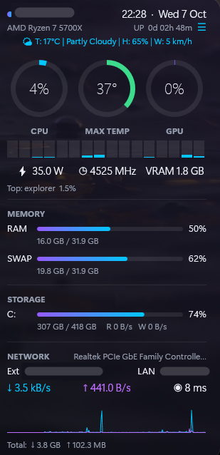

<div align="center">

# ✨ Coreglow

**A modern, glowing system monitor skin for [Rainmeter](https://www.rainmeter.net) on Windows 11.**

CPU · GPU · temperature · power · RAM · network · weather, all in one clean, theme-aware panel.


</div>

---

## Preview

<p align="center">
  
</p>

## Features

| | |
|---|---|
| 🔥 **CPU** | Usage ring, max temperature ring (green → amber → red), package power (W), clock (MHz), CPU name |
| 🧵 **Per-thread load** | One bar per logical processor. Adapts to **any CPU** automatically and turns color with load |
| 🎮 **GPU** | Usage ring and dedicated VRAM in use, read from Windows counters with no extra software |
| 🧠 **Memory** | RAM and swap/commit bars with used / total |
| 💾 **Storage** | C: drive usage plus live read/write speed |
| 🌐 **Network** | External and LAN IP, adapter, ↓/↑ speed, ping, live traffic graph, total traffic |
| 🌤️ **Weather** | Icon, temperature, conditions, humidity and wind from [wttr.in](https://wttr.in). Location and units auto-detected by IP. Hover for feels-like and location |
| ⏱️ **System** | Clock and date, Windows uptime, top CPU process |
| 📊 **Tooltips** | Min, max and 1-hour average for CPU and temperature |
| 🎨 **Look & feel** | Vector Shape meters, gradients, rounded corners, hover glow, collapsible panel (☰), automatic light/dark theme that follows Windows |
| 🖱️ **Click actions** | CPU → Task Manager · C: → Explorer · Network → Settings · Weather → forecast |

## Requirements

| Software | Purpose |
|---|---|
| [Rainmeter](https://www.rainmeter.net) 4.5+ | Runs the skin |
| [Core Temp](https://www.alcpu.com/CoreTemp/) | CPU temperature, power, clock and name. Must be running |
| [Core Temp Rainmeter plugin](https://www.alcpu.com/CoreTemp/) (`CoreTemp.dll`) | Lets Rainmeter read Core Temp. Find it on the Core Temp site under *Add-ons* |

Everything else (UsageMonitor, PingPlugin, WebParser) comes with Rainmeter.

## Installation

**Option 1: installer (recommended)**
1. Download `Coreglow_x.y.rmskin` from the [Releases](../../releases) page.
2. Double-click it, then click **Install**.

**Option 2: manual**
1. Copy `Coreglow-backup/Coreglow` to `%USERPROFILE%\Documents\Rainmeter\Skins\`.
2. Rainmeter tray icon → **Refresh all** → **Manage** → **Coreglow → Coreglow.ini** → **Load**.

See [INSTALL.md](Coreglow-backup/INSTALL.md) for details and troubleshooting.

## Customization

Right-click the skin → **Edit variables**, or edit `@Resources/Variables.inc`:

```ini
Accent1=0,200,255,255      ; gradient start (cyan)
Accent2=150,90,255,255     ; gradient end (violet)
TempWarn=60                ; °C → amber
TempHot=80                 ; °C → red
WeatherLoc=                ; empty = auto-detect from your IP, or a city, airport code or lat,lon
WeatherUnits=              ; empty = automatic for the region, or m / u (imperial) / M (wind m/s)
```

Light and dark colors live in `@Resources/Theme1.inc` and `Theme0.inc`.

> **Note:** `Coreglow.ini` is saved as **UTF-16 LE** so that the symbols render. Keep that encoding when you edit it.

## Building the installer

```powershell
.\tools\sync.ps1                       # copy the live skin from Documents\Rainmeter\Skins into the repo
.\tools\build-rmskin.ps1 -Version 1.1  # → dist\Coreglow_1.1.rmskin
```

## Roadmap

See [ROADMAP.md](ROADMAP.md). Next up: GPU temperature via HWiNFO, a 3-day forecast, a settings panel and high-DPI scaling.

## Credits

- [Rainmeter](https://www.rainmeter.net) and its documentation
- [Core Temp](https://www.alcpu.com/CoreTemp/) by Arthur Liberman
- Weather by [wttr.in](https://github.com/chubin/wttr.in)
- External IP by [ipify](https://www.ipify.org)

## License

[MIT](LICENSE) © 2026 Stavros Antoniou
